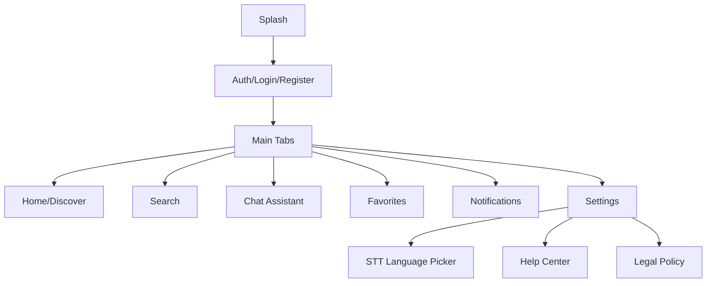

# VietSpots — Báo cáo Frontend (Computational Thinking)

## 1) Tóm tắt dự án

**VietSpots** là ứng dụng Flutter giúp người dùng khám phá địa điểm du lịch ở Việt Nam và tương tác với trợ lý chat AI. Báo cáo này tập trung vào **frontend (Flutter)**: kiến trúc, luồng xử lý chính, cách áp dụng tư duy Computational Thinking (CT), và cách kiểm thử/chạy trên Android.

**Phạm vi**
- Frontend Flutter trong thư mục `lib/`.
- Tích hợp backend qua lớp gọi API (không phân tích sâu backend).

**Mục tiêu CT của bài**
- Mô tả rõ cách **phân rã bài toán**, **nhận diện mẫu**, **trừu tượng hóa**, và **thiết kế thuật toán** cho các luồng chính (Chat, STT, TTS, lưu lịch sử, đa ngôn ngữ).

---

## 2) Decomposition — Phân rã bài toán (chia lớp/chức năng)

Frontend được chia theo các khối chức năng chính:

1) **Presentation/UI (screens & widgets)**
- Hiển thị giao diện, nhận thao tác người dùng.
- Ví dụ: `lib/screens/main/chat_screen.dart`, `lib/screens/main/settings_screen.dart`.

2) **State Management (providers)**
- Giữ trạng thái và điều phối luồng nghiệp vụ UI ↔ service.
- Ví dụ: `lib/providers/chat_provider.dart`, `lib/providers/localization_provider.dart`, `lib/providers/theme_provider.dart`.

3) **Services (tầng tích hợp dữ liệu/backend)**
- Gọi API, xử lý HTTP, chuyển đổi response, timeout, lỗi mạng.
- Ví dụ: `lib/services/api_service.dart`, `lib/services/chat_service.dart`, `lib/services/place_service.dart`.

4) **Models (dữ liệu miền nghiệp vụ)**
- Định nghĩa cấu trúc dữ liệu dùng trong app.
- Ví dụ: `lib/models/chat_model.dart`, `lib/models/place_model.dart`.

5) **Utils/Design system**
- Theme, typography, token hóa UI để nhất quán.
- Ví dụ: `lib/utils/theme.dart`, `lib/utils/typography.dart`.

Từ góc nhìn CT, đây là bước “chia nhỏ vấn đề” để:
- Dễ phát triển theo module.
- Dễ test theo lớp (unit/widget).
- Dễ khoanh vùng lỗi (API vs UI vs state).

---

## 3) Pattern Recognition — Nhận diện mẫu (pattern)

Trong code có các mẫu lặp lại quan trọng:

### 3.1 Provider pattern (State → UI)
Mẫu chung:
- UI đọc provider (via `Provider.of<T>(context)` hoặc `Consumer<T>`)
- Provider gọi service
- Service gọi `ApiService`
- Trả kết quả về provider → UI rebuild

### 3.2 “Service layer” cho mọi API
Các endpoint được gom vào các service theo miền nghiệp vụ (auth/place/chat/…)
Giúp:
- Tránh gọi HTTP rải rác trong UI.
- Chuẩn hóa timeout, headers, error parsing.

### 3.3 Chuẩn hóa lỗi API (defensive parsing)
Mẫu lỗi thường gặp từ backend: trường `message/detail` có thể không phải `String` (ví dụ: list/map).
Giải pháp: ép về `String` an toàn ở tầng `ApiResponse`/`ApiService` để UI không crash.

### 3.4 i18n key-value
`LocalizationProvider` dùng map key → string theo ngôn ngữ.
Mẫu: UI gọi `loc.translate('some_key')` thay vì hard-code.

---

## 4) Abstraction — Trừu tượng hóa

### 4.1 Trừu tượng hóa dữ liệu
- Dữ liệu được đóng gói thành model (chat message, place, user…).
- UI không cần biết JSON chi tiết, chỉ làm việc với object.

### 4.2 Trừu tượng hóa API
- `ApiService` ẩn chi tiết HTTP (`headers`, `timeout`, parse JSON/binary).
- `ChatService` ẩn chi tiết endpoint chat/STT/TTS.

### 4.3 Trừu tượng hóa đa ngôn ngữ
- UI chỉ biết key.
- Dễ thêm ngôn ngữ mới bằng cách bổ sung map.

---

## 5) Algorithm Design — Thiết kế thuật toán (luồng xử lý)

Phần này mô tả luồng dưới dạng “thuật toán” theo CT.

### 5.1 Luồng kiến trúc tổng quan

```mermaid
flowchart LR
  UI[UI Screens/Widgets] --> P[Providers (State)]
  P --> S[Services]
  S --> A[ApiService]
  A --> B[(Backend API)]
  P --> L[LocalizationProvider]
  UI --> L
  P --> T[ThemeProvider]
  UI --> T
```

Ý nghĩa:
- UI không gọi HTTP trực tiếp.
- Provider là “bộ điều phối” trạng thái.
- Service chịu trách nhiệm logic tích hợp backend.

---

### 5.2 Thuật toán gửi tin nhắn Chat (mức frontend)

Pseudocode (tư duy thuật toán):

```text
INPUT: userText
IF userText rỗng -> dừng
1) UI tạo message của user và push vào list
2) Provider set isTyping = true
3) Gọi ChatService.sendMessage(userText)
4) Nếu success:
     append message bot (có thể markdown)
   Nếu fail:
     append message lỗi thân thiện
5) Provider set isTyping = false
OUTPUT: UI hiển thị hội thoại cập nhật
```

Các điểm CT:
- Điều kiện dừng sớm (input rỗng).
- Trạng thái trung gian `isTyping` (tách “processing” khỏi “rendering”).

---

### 5.3 Luồng STT (Speech-to-Text) trên thiết bị

Mục tiêu: ưu tiên STT on-device (`speech_to_text`) và lưu lựa chọn ngôn ngữ.

```mermaid
flowchart TD
  A[User chọn STT Language] --> B[Lưu preferred_stt_language (SharedPreferences)]
  C[User bấm mic] --> D[Request permission + init speech_to_text]
  D -->|OK| E[Start listen localeId]
  E --> F[Nhận partial/final result]
  F --> G[Đổ text vào input chat]
  D -->|Fail| H[Hiển thị thông báo lỗi / fallback (nếu có)]
```

Ghi chú triển khai:
- Màn chọn ngôn ngữ STT: `lib/screens/settings/settings_tree.dart`.
- Key i18n liên quan: `stt_language`, `speech_language`.

---

### 5.4 Luồng TTS (Text-to-Speech) đọc to tin nhắn

Mục tiêu: ưu tiên backend tạo MP3 (chất lượng/đa ngôn ngữ tốt), fallback `flutter_tts`.

```mermaid
flowchart TD
  A[User long-press message] --> B[Bottom sheet action]
  B -->|Read aloud| C[Call backend /tts (binary MP3)]
  C -->|Success| D[Lưu temp file/cache]
  D --> E[Play bằng audioplayers]
  C -->|Fail| F[Fallback flutter_tts.speak]
```

Điểm CT:
- Thiết kế “nhánh dự phòng” (fallback) để tăng độ bền.
- Tối ưu UX: không crash nếu backend trả lỗi/format khác kỳ vọng.

---

### 5.5 Thuật toán hiển thị thời gian “time ago” theo i18n

Mục tiêu: tránh hard-code `'Just now'`, `'min ago'`…

```text
INPUT: createdAt
delta = now - createdAt
IF delta < 1 phút -> translate(time_just_now)
ELSE IF delta < 60 phút -> translate(time_minutes_ago, n)
ELSE IF delta < 24 giờ -> translate(time_hours_ago, n)
ELSE -> translate(time_days_ago, n)
OUTPUT: chuỗi theo ngôn ngữ hiện tại
```

---

## 6) Sơ đồ điều hướng (Navigation map)



---

## 7) Độ tin cậy & xử lý lỗi (Robustness)

### 7.1 Defensive parsing cho lỗi backend
Vấn đề thực tế khi chạy Android:
- Backend có thể trả `message` không phải `String` (List/Map) → dễ gây lỗi type ở frontend.

Giải pháp:
- Ép `message/detail` sang `String` an toàn ở tầng `ApiResponse`/`ApiService`.
- UI chỉ hiển thị chuỗi, tránh crash.

File liên quan:
- `lib/services/api_service.dart`

### 7.2 Timeout & ưu tiên UX
- Một số thao tác “không quan trọng ngay” (ví dụ lưu message) có thể dùng timeout ngắn hơn để tránh UI bị treo.
- Các thao tác quan trọng (chat/ai) có thể cần timeout dài hơn tuỳ backend.

### 7.3 Fallback strategy
- STT: ưu tiên on-device → fallback (nếu có).
- TTS: ưu tiên backend MP3 → fallback `flutter_tts`.

---

## 8) Kiểm thử (Testing)

Thư mục `test/` có các bài test nhằm đảm bảo các luồng chính không bị regress:
- `test/chat_screen_test.dart`
- `test/notification_navigation_test.dart`
- `test/registration_validation_test.dart`
- `test/widget_test.dart`

Quy trình kiểm tra chất lượng tối thiểu:
1) Phân tích tĩnh:
   - `flutter analyze`
2) Chạy test:
   - `flutter test`

---

## 9) Hướng dẫn chạy trên Android

### 9.1 Cài dependencies
- `flutter pub get`

### 9.2 Cấu hình API backend
Base URL đang nằm tại:
- `lib/services/api_service.dart` → `ApiConfig.baseUrl`

Ví dụ (tuỳ môi trường):
- Dev local: `http://10.0.2.2:8000/api` (Android emulator)
- Device thật cùng mạng: `http://<LAN_IP>:8000/api`
- Production: URL deploy (Railway/Render/…)

### 9.3 Chạy
1) Kiểm tra thiết bị:
   - `flutter devices`
2) Run:
   - `flutter run -d <deviceId>`

---

## 10) Tự chấm điểm theo thang 100 (frontend)

Tiêu chí (gợi ý chấm theo CT + engineering):

1) **Kiến trúc & phân lớp (20đ)**
   - UI/Provider/Service tách rõ, dễ bảo trì.

2) **Độ tin cậy & xử lý lỗi (20đ)**
   - Timeout hợp lý, parse lỗi an toàn, không crash vì type mismatch.

3) **Tính năng tương tác Chat + STT/TTS (25đ)**
   - Luồng sử dụng rõ, fallback hợp lý.

4) **i18n & UX nhất quán (15đ)**
   - Không hard-code chuỗi quan trọng, hỗ trợ đa ngôn ngữ.

5) **Kiểm thử & chất lượng code (20đ)**
   - `flutter analyze` sạch, `flutter test` pass.

Trạng thái hiện tại (theo kiểm tra trong workspace):
- `flutter analyze`: **No issues found**
- `flutter test`: **All tests passed**

---

## 11) Ghi chú phạm vi “xóa các thứ không cần thiết”

Trong phạm vi an toàn của frontend, README này đã được rút gọn/đổi sang dạng báo cáo CT đúng yêu cầu.

Nếu bạn muốn **xóa file/tài liệu phụ** (ví dụ các file ghi chú như `FIXES_IMPLEMENTED.md`, `DETAILED_CHANGES.md`, …), mình cần bạn xác nhận rõ:
- Xóa file nào (liệt kê), hay chỉ “dọn README”?
