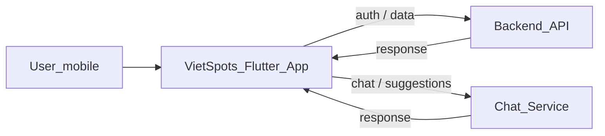
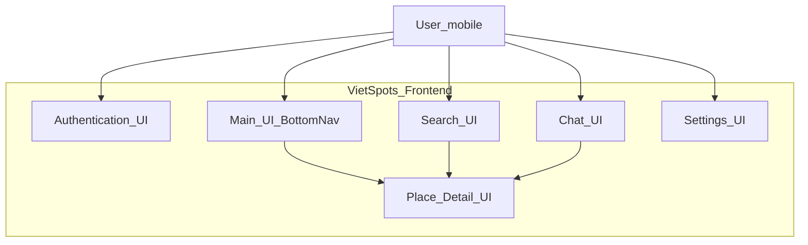
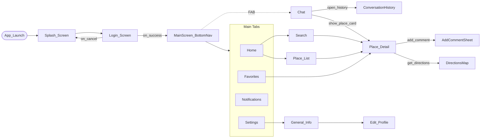

**Mô tả hệ thống đã xây dựng theo Tư duy tính toán (Computational Thinking)**

3.1 Phân tích bài toán (Problem Analysis)

Phần frontend của đồ án đặt mục tiêu tạo ra một giao diện người dùng trực quan, ổn định và dễ tương tác cho ứng dụng di động viết bằng Flutter, chịu trách nhiệm thu thập yêu cầu của người dùng, hiển thị gợi ý điểm tham quan và tổ chức các thao tác liên quan đến quản lý tài khoản, ưu tiên và lịch sử tương tác. Từ góc nhìn giao diện, người dùng cần thực hiện một số thao tác chính: xác thực (đăng nhập/đăng ký/khôi phục mật khẩu), thiết lập và chỉnh sửa hồ sơ cá nhân, nhập thông tin đầu vào cho việc gợi ý (từ khóa tìm kiếm, lựa chọn khu vực, bộ lọc cơ bản), tương tác với chatbot để tinh chỉnh nguyện vọng và duyệt danh sách kết quả, mở trang chi tiết điểm đến để xem thông tin, lưu yêu thích hoặc mở chỉ đường.

Frontend chịu trách nhiệm thu nhận dữ liệu đầu vào ở hai dạng: dữ liệu cấu trúc cho mục xác thực và hồ sơ (email, mật khẩu, tên, số điện thoại, ưu tiên) và dữ liệu truy vấn cho chức năng gợi ý (từ khóa, phạm vi, bộ lọc). Ngoài dữ liệu người nhập, frontend còn phải quản lý các trạng thái hiển thị như đang tải, thành công, rỗng hoặc lỗi để đảm bảo thông tin phản hồi tới người dùng luôn rõ ràng và kịp thời. Những khó khăn khi thiết kế frontend xuất phát từ số lượng màn hình và trạng thái đa dạng (màn hình chính nhiều chế độ, khung chat với trạng thái typing, hệ thống thông báo, cây menu cài đặt và khảo sát người dùng), việc đồng bộ trạng thái người dùng giữa các màn hình, và đảm bảo hiệu năng khi render các danh sách, ảnh và bản đồ.

3.2 Phân rã hệ thống (Decomposition)

Đáp ứng yêu cầu trên, phần frontend được phân rã thành các nhóm có trách nhiệm rõ ràng nhằm giảm độ phức tạp và tạo thuận lợi cho phát triển song song. Ở mức cao, các nhóm màn hình chính gồm: Authentication (đảm nhiệm các màn hình thuộc `lib/screens/auth`), Home/Discovery (màn hình `home_screen.dart`, `search_screen.dart`, `favorites_screen.dart`), Chat (màn hình hội thoại `chat_screen.dart` kèm drawer lịch sử), Notification (hiển thị danh sách và chi tiết thông báo), Settings & Profile (cây màn hình trong `settings_tree.dart` như General Info, Preferences, Permissions). Mỗi nhóm màn hình tương ứng với một container trách nhiệm trong kiến trúc ứng dụng và tương tác với các provider để đọc/ghi trạng thái.

Ở mức chi tiết, kiến trúc frontend tách rõ các thành phần: widget giao diện tái sử dụng (`PlaceCard`, `AvatarCropDialog`), các form nhập liệu (login, registration, edit profile), và các lớp quản lý trạng thái (các `Provider` như `AuthProvider`, `ChatProvider`, `PlaceProvider`, `LocalizationProvider`, `ThemeProvider`). Ngoài ra, bộ tiện ích (utilities) đảm nhận việc format dữ liệu, validate input, và truy cập lưu trữ cục bộ. Mục tiêu của phân rã là giảm coupling giữa màn hình, tăng khả năng test độc lập và cho phép tái sử dụng các thành phần giao diện trong ngữ cảnh khác nhau.

3.3 Nhận dạng mẫu (Pattern Recognition)

Trong quá trình phát triển, nhiều mẫu lặp lại được nhận dạng và tiêu chuẩn hoá để giảm trùng lặp và tăng tính nhất quán. Mẫu xử lý form là một ví dụ điển hình: mỗi form thực hiện validate cục bộ, chuyển sang trạng thái gửi, gọi hàm service bất đồng bộ và cuối cùng cập nhật state hoặc hiển thị lỗi. Mẫu này được gom vào các helper và quy ước đặt tên giúp tất cả form tuân thủ cùng một luồng hành xử.

Mẫu điều hướng cũng lặp lại: ứng dụng sử dụng các transition có quy ước khi truyền tham số giữa các màn hình (ví dụ truyền đối tượng `Place` từ `PlaceCard` sang `PlaceDetailScreen`), và quản lý stack navigation qua `MainScreen` sử dụng `IndexedStack` cho bottom navigation. Mẫu quản lý trạng thái với `Provider`/`ChangeNotifier` cho phép các module duy trì state riêng, đồng thời cung cấp API thống nhất cho UI để refresh, load more hoặc reset state.

Mẫu hiển thị dữ liệu gồm ba trạng thái lặp lại là loading, empty và error. Các widget chung cho từng trạng thái được tái sử dụng xuyên suốt ứng dụng để đảm bảo hành vi và ngôn ngữ hiển thị nhất quán, từ danh sách gợi ý đến chi tiết địa điểm hay luồng chat.

3.4 Trừu tượng hóa (Abstraction)

Trong thiết kế frontend, những gì được giữ ở mức trừu tượng là giao diện, trạng thái và hành vi người dùng; những chi tiết phức tạp như thuật toán gợi ý, xử lý AI hay logic lưu trữ server-side hoàn toàn bị che giấu phía sau các interface trừu tượng. Cụ thể, frontend chỉ tương tác với các service ở dạng lời gọi có ý nghĩa (ví dụ `fetchPlaces()`, `sendChatMessage()`), không cần quan tâm cách backend triển khai chi tiết.

Các công cụ trừu tượng hoá bao gồm `Provider` (tạo lớp trung gian giữa UI và service), repository/service layer (đóng gói các cuộc gọi HTTP hoặc kết nối tới AI), và helper/utility (xử lý validate, format, map dữ liệu). Widget tái sử dụng (ví dụ `PlaceCard`, `ChatBubble`) giúp che giấu chi tiết hiển thị trong khi vẫn đơn giản hoá việc tái cấu trúc giao diện khi cần. Nhờ trừu tượng hoá, khi backend thay đổi giao diện API hoặc khi cần đổi nguồn dữ liệu, phần UI ít bị ảnh hưởng và chỉ cần điều chỉnh ở lớp service/repository.

3.5 Thiết kế thuật toán (Algorithm Design – góc nhìn frontend)

Ở góc nhìn frontend, "thuật toán" được hiểu là các luồng xử lý tuần tự và điều kiện kiểm tra để đảm bảo trải nghiệm người dùng mượt mà và nhất quán. Ví dụ luồng đăng ký tài khoản: giao diện thu thập thông tin, thực hiện validate cục bộ (email, mật khẩu), gọi `AuthProvider.register()` và xử lý phản hồi. Nếu thành công, UI chuyển trạng thái và lưu thông tin phiên; nếu thất bại, hiển thị lỗi có hướng dẫn sửa.

Luồng cập nhật hồ sơ cá nhân gồm thu thập input từ form, kiểm tra quyền truy cập (ví dụ khi đổi avatar cần quyền truy cập ảnh), cho phép chọn ảnh từ gallery và sử dụng `AvatarCropDialog` để chỉnh, sau đó gọi provider để lưu thay đổi và cập nhật state hiển thị.

Luồng gửi tin nhắn trong chat được thiết kế theo mô hình optimistic UI: khi người dùng gửi, frontend lập tức thêm tin nhắn vào `MessageList` để cải thiện cảm nhận tốc độ, đồng thời gọi `ChatProvider.sendMessage()` bất đồng bộ. Khi nhận phản hồi từ AI, provider cập nhật luồng hội thoại; khi có lỗi mạng, frontend bật trạng thái lỗi trên tin nhắn và cung cấp nút thử lại. Các điều kiện kiểm tra lặp lại bao gồm validate input, kiểm tra kết nối mạng và quyền (permissions), và rollback khi thao tác không thành công.

Thay đổi cài đặt là những thao tác đơn giản hơn: thay đổi lưu trong `SharedPreferences` qua lớp provider, một số thay đổi như ngôn ngữ yêu cầu reload lại các chuỗi i18n (do `LocalizationProvider` đảm nhiệm), và UI phản hồi ngay bằng các indicator.

3.6 Mô phỏng và kiểm thử (Simulation & Testing)

Để đảm bảo chất lượng phần frontend, nhiều kịch bản mô phỏng và kiểm thử được áp dụng. Mô phỏng hành vi người dùng bao gồm nhập dữ liệu không hợp lệ (email sai định dạng, mật khẩu yếu), từ chối quyền truy cập (quyền ảnh hoặc vị trí), và các trạng thái dữ liệu rỗng (không có kết quả tìm kiếm). Mỗi trường hợp được quan sát phản hồi UI để đảm bảo không có lỗi crash và có thông báo hướng dẫn.

Kiểm thử ở mức widget (unit/widget tests) được sử dụng để xác thực các widget cốt lõi như `PlaceCard` hoặc form validation hoạt động đúng; kiểm thử điều hướng xác nhận luồng chuyển màn hình và truyền tham số; kiểm thử tích hợp (smoke/integration tests) mô phỏng các luồng chính như đăng nhập → tìm kiếm → mở chi tiết để phát hiện vấn đề liên kết giữa các module. Việc kiểm thử tự động kết hợp với thủ công trong một số luồng phức tạp (chat với AI giả lập) giúp giảm nguy cơ lỗi khi triển khai.

3.7 Kết luận

Tổng hợp lại, phần frontend của đồ án đã ứng dụng các bước tư duy tính toán một cách có hệ thống: phân tích yêu cầu từ góc nhìn người dùng, phân rã hệ thống thành các thành phần nhỏ, nhận dạng và chuẩn hoá các mẫu lặp lại, trừu tượng hoá các chi tiết phức tạp, thiết kế các luồng xử lý rõ ràng và tiến hành kiểm thử có hệ thống. Những thực hành này mang lại lợi ích thực tế: giao diện nhất quán và dễ hiểu, khả năng mở rộng khi cần bổ sung màn hình mới, và khả năng bảo trì cao nhờ tách biệt trách nhiệm rõ ràng giữa UI, state management và service layer. Trong bối cảnh tôi phụ trách phần frontend, tư duy tính toán đã giúp tổ chức công việc hiệu quả, giảm rủi ro kỹ thuật và tạo nền tảng vững chắc để tích hợp với phần backend/AI mà không làm phức tạp mã giao diện.

---

Tài liệu này tập trung mô tả vai trò và hiện trạng phần frontend; các chi tiết triển khai backend/AI nằm ngoài phạm vi báo cáo nhưng được tham chiếu ở mức giao tiếp (API/endpoint) khi cần thiết để làm rõ trách nhiệm phần frontend.

## C4 — User Flow (Context / Container / Component)

Để minh hoạ luồng người dùng và ranh giới trách nhiệm frontend, dưới đây là ba sơ đồ C4 ở các mức: Context, Container và Component (user flow). Các sơ đồ chỉ phản ánh các màn hình và hành vi có trong phần frontend của đồ án.

### Context (level 1)

### Container (level 2)

### Component / User Flow (level 3)

Ghi chú: các sơ đồ trên mô tả phạm vi frontend và các tuyến điều hướng chính mà người dùng có thể trải nghiệm. Các thành phần backend/AI được thể hiện là hệ thống bên ngoài và nằm ngoài mô tả chi tiết trong báo cáo này.